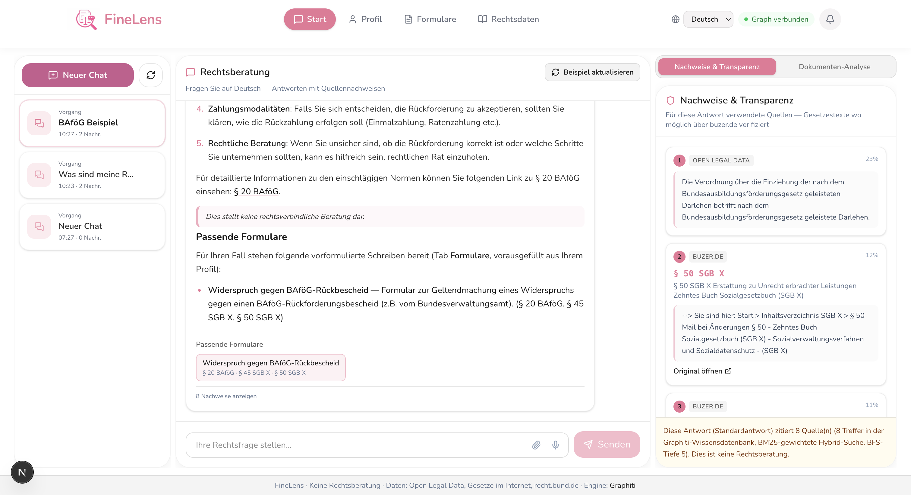
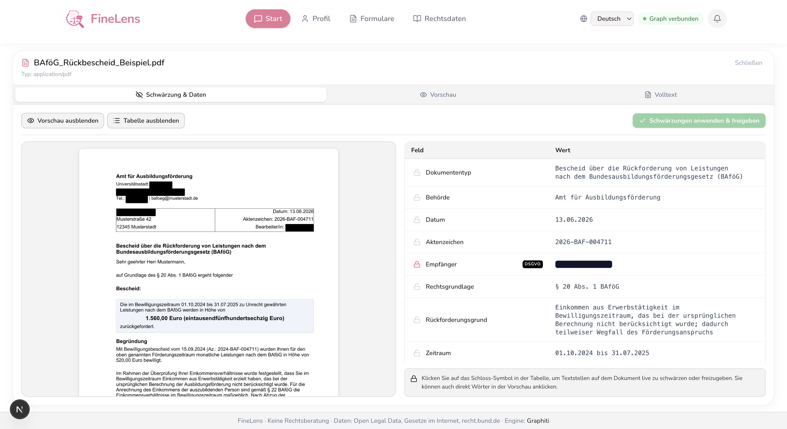
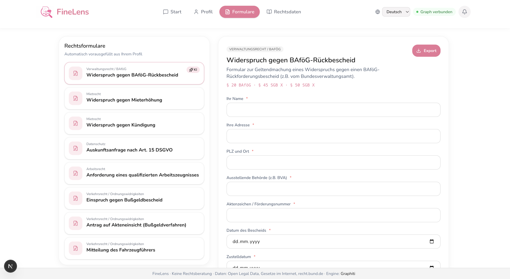

# FineLens

Transparent German legal assistant powered by [Graphiti](https://github.com/getzep/graphiti) knowledge graphs.

Ask legal questions in German, get answers with **source citations** traced back to Graphiti episodes, and receive **prefilled legal forms** based on your profile.

## Hamburg Legal Hackathon 2026

FineLens was built for the **[2. Hamburg Legal Hackathon](https://hamburg-legal-hackathon.de/)** — **12.–14. June 2026** at Bucerius Law School in Hamburg. Under the theme **“(Legal) AI Buddies”**, interdisciplinary teams developed practical AI helpers for the legal domain.

### Idea

Many people receive official letters (e.g. BAföG repayment notices, traffic fines, tenancy disputes) without knowing what they mean, which deadlines apply, or what they can do next. FineLens is a **Civic & Legal Office Buddy**: upload a document or ask a question in plain language, get a structured legal assessment in Gutachtenstil, and move directly to **prefilled forms** (Widerspruch, DSGVO-Auskunft, Mietwiderspruch, and more) grounded in real statutes.

### Novelty

Unlike typical RAG chatbots that retrieve flat text chunks, FineLens models German law as a **knowledge graph**:

- **Legal ontology** — Statutes are decomposed into *Tatbestandsmerkmale*, *Rechtsfolgen*, and *LegalSubjects*, mirroring how lawyers read norms.
- **Multi-hop retrieval** — `REFERENCES` edges capture cross-references (e.g. § 558 BGB → §§ 559–560) for complex questions.
- **Full traceability** — Every answer cites Graphiti episodes with law reference, title, excerpt, and URL back to the primary source.
- **Document intelligence** — PDF analysis extracts fields with bounding boxes, flags PII for redaction, and applies domain rules (e.g. statutory one-year deadline when a *Rechtsbehelfsbelehrung* is missing under § 58 Abs. 2 VwGO).
- **Human-in-the-loop privacy** — Before any document text is sent to the LLM, users review extracted fields, redact personal data (DSGVO), and explicitly release the sanitized version.
- **Open legal corpus** — Ingestion pipelines connect Open Legal Data, Gesetze im Internet, recht.bund.de, and buzer.de into one searchable graph.

### Contribution

Over one hackathon weekend, the team delivered a **working end-to-end prototype**: Next.js frontend, FastAPI backend, Graphiti + FalkorDB graph store, a demo BAföG workflow, interactive knowledge-graph visualization, and prefilled forms tied to norms in the graph — showing how transparent, graph-based legal AI can support citizens without replacing qualified legal advice.

## Demo

The screenshots and video below use **synthetic example data only** (placeholder names, addresses, and case numbers). No real personal information is included.

### 1. Legal chat with transparent citations

Upload a document or ask a question — FineLens answers in Gutachtenstil, suggests follow-up questions, links to relevant forms, and shows every source used (with relevance scores from the Graphiti knowledge graph).



### 2. Human-in-the-loop PII redaction

After PDF upload, FineLens extracts structured fields (authority, case reference, legal basis, amounts, deadlines). Personal data is flagged as DSGVO-sensitive; users redact it in the preview or table before releasing the document for analysis.



[Watch the redaction workflow (video)](frontend/public/demo_human_in_loop_remove_confidential_data.mov)

### 3. Prefilled legal forms

Extracted profile and document data flows into legal forms — e.g. *Widerspruch gegen BAföG-Rückbescheid*, rent objections, DSGVO requests, and traffic-law appeals — each tied to the underlying statutes.



## Features

- **Graphiti Knowledge Graph** — Ingests laws from Open Legal Data, Gesetze im Internet, and recht.bund.de
- **Transparent Answers** — Every response shows citations with law references and source URLs
- **Document Analysis** — PDF field extraction with bounding boxes, PII detection, and human-in-the-loop redaction
- **Interactive Forms** — Mietwiderspruch, Kündigungswiderspruch, DSGVO-Auskunft, Arbeitszeugnis — prefilled from user profile
- **Profile Wizard** — 3-step onboarding collects data used across forms and chat context
- **Source Dashboard** — Overview of all integrated legal data sources

## Architecture

```
┌─────────────────┐     ┌──────────────────┐     ┌─────────────┐
│  Next.js UI     │────▶│  FastAPI Backend │────▶│  Graphiti   │
│  (FineLens)     │     │  /chat /forms    │     │  + FalkorDB │
└─────────────────┘     └────────┬─────────┘     └─────────────┘
                                 │
                    ┌────────────┼────────────┐
                    ▼            ▼            ▼
                    Open Legal   Gesetze im    recht.bund.de
                       Data       Internet      + buzer.de
                                 + beck/juris (Referenz)
```

## Quick Start

### 1. Graph database

**Option A — Embedded (default, no Docker):** Set `GRAPH_BACKEND=embedded` in `.env`. Uses FalkorDB Lite locally at `backend/data/graphiti.db`.

**Option B — Docker FalkorDB:** If you have Redis on port 6379, FalkorDB is mapped to **6380** to avoid conflicts:

```bash
docker compose up -d
# Then set GRAPH_BACKEND=falkordb and FALKORDB_PORT=6380 in .env
```

### 2. Configure environment

```bash
cp .env.example .env
# Add your OPENAI_API_KEY
```

### 3. Start the backend

```bash
cd backend
python -m venv .venv
source .venv/bin/activate
pip install -e .
uvicorn app.main:app --reload --port 8000
```

### 4. Seed demo legal data

```bash
# Via API
curl -X POST http://localhost:8000/ingest/seed

# Or via script
python scripts/seed.py
```

### 5. Start the frontend

```bash
cd frontend
cp .env.local.example .env.local
npm install
npm run dev
```

Open [http://localhost:3000](http://localhost:3000).

## Legal Data Sources

| Source | URL | Integration |
|--------|-----|-------------|
| Open Legal Data | de.openlegaldata.io | REST API ingestion |
| Gesetze im Internet | gesetze-im-internet.de | XML TOC + HTML fetch |
| recht.bund.de | rechtsinformationen.bund.de | REST API |
| buzer.de | buzer.de | HTML scraping (§-level) |
| beck-online | beck-online.beck.de | Reference index (license required) |
| juris | juris.de | Reference index (license required) |

## API Endpoints

| Method | Path | Description |
|--------|------|-------------|
| POST | `/chat` | Ask a legal question |
| GET/PUT | `/users/{id}` | User profile |
| GET | `/forms` | List prefilled forms |
| POST | `/ingest` | Ingest from a source |
| POST | `/ingest/seed` | Seed demo data |
| GET | `/health` | System status |

## Citation

If you use FineLens in research or publications, please cite it. Metadata is in [`CITATION.cff`](CITATION.cff) (GitHub and Zenodo compatible).

```bibtex
@software{finelens2026,
  author       = {Alasti, Amirreza and Erdal, Efe},
  title        = {FineLens: Transparent German Legal Assistant with Graphiti Knowledge Graphs},
  year         = {2026},
  url          = {https://github.com/amirrezaalasti/RechtsLens},
  version      = {0.1.0},
  note         = {Built for the 2. Hamburg Legal Hackathon, 12--14 June 2026}
}
```

## License

This project is licensed under the [MIT License](LICENSE).

## Disclaimer

FineLens provides legal **information**, not legal **advice**. Always consult a qualified attorney for binding guidance.
